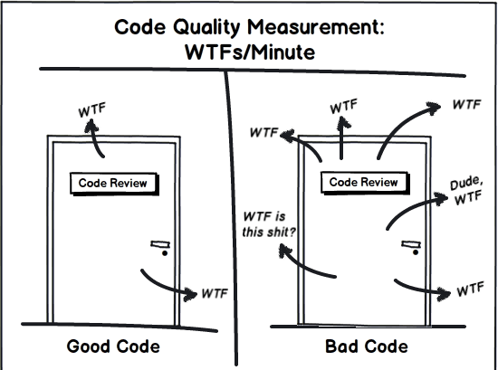
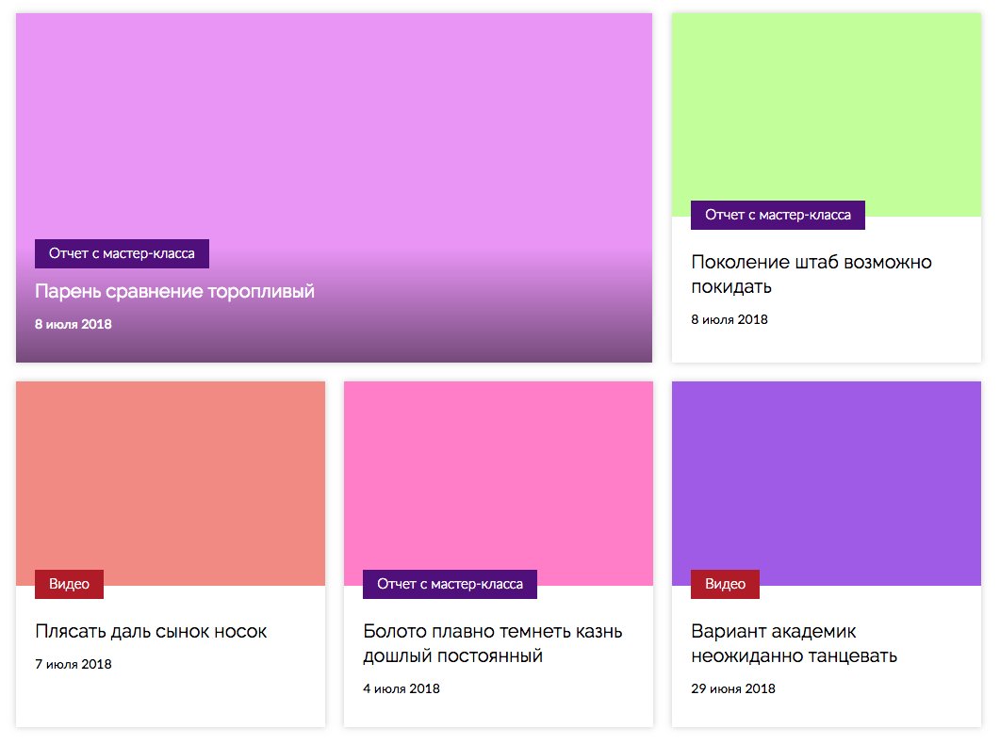
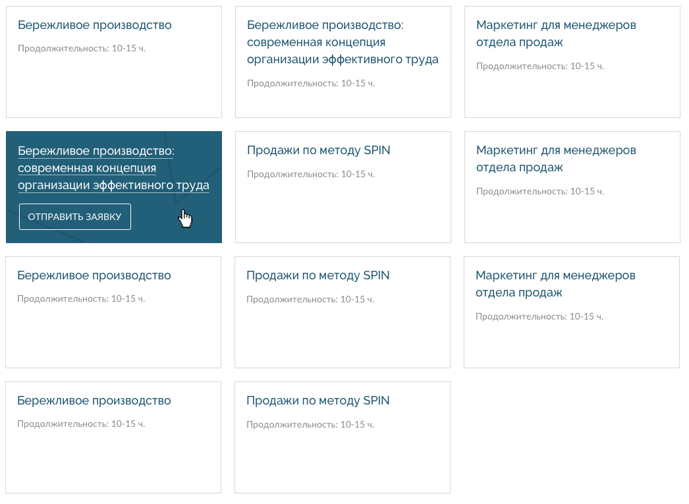

# Практики хорошего кода

## О чем это

Термины «хороший» и «плохой» нечеткие.

Чтобы научиться различать хороший и плохой код надо потратить время.

Чтобы научиться писать хороший код надо потратить время.

Изначально у нас есть набор базовых знаний, в который не входит умение писать красивый профессиональный код.

Обычно это умение приходит вместе с практическим опытом, чаще всего в той или иной степени негативным.

Но путь к хорошему коду можно срезать, если учитывать опыт других людей и практиковаться!

## Вы должны писать хороший код


Код гораздо чаще читают, нежели пишут.

Следовательно код должен быть приспособлен к тому, чтобы его понимали люди, а не только машины.

Понятность кода обеспечивается хорошей, наглядной, ясной, недвусмысленной (и т.д.) организацией.

Такая организация невозможна без проектирования.

Перед написанием код необходимо спроектировать.

Проектирование дает:

- ### Простоту и понятность

  Чтобы _в будщем_ разработчик смог быстро разобраться и доработать компонент под изменившиеся требования.

- ### Корректность

  Чтобы _в будщем_ инженер своими правками случайно не сломал работоспособность системы.

- ### Расширяемость

  Чтобы _в будщем_ инженеру проще было вносить доработки под новые требования.

- ### Универсальность

  Чтобы _в будщем_ инженеру было проще использовать этот код в контексте другой задачи или проекта.

Код нельзя рассматривать, как свершившийся факт, необходимо учитвывать, что он будет меняться.
Любые признаки хорошего и плохого кода важны только в контексте изменения. Важно то, как они будут помогать или мешать вносить изменения.

## Что такое плохой код



### Код плох, если

когда приходит новая задача...

- ...надо много переделывать (жесткость)

  переделывая код, можно внести нежелательные правки и дефекты

- ...трогать код опасно (хрупкость)

  при внесении правок есть страх, что сломается что-то другое

- ...проще сделать «в обход» (вязкость)

  возможно, уже есть какой-то инструмент для решения, но вместо этого все делается с нуля

- ...не получается использовать готовое решение в новом контексте (неподвижность)

## Принципы хорошего кода

- ## Читаемость

Для каждого проекта необходимо установить и соблюдать опеределенные соглашения — code style.

### Этапы обеспечения Code Style:

#### tl;dr Единообразие вносит красоту даже в безобразие.

0.  Линтер (ESLint, stylelint)

Позволяет проводить анализ качества вашего кода, написанного на любом выбранном стандарте JavaScript. Он приводит код к более-менее единому стилю, помогает избежать глупых ошибок, умеет автоматически исправлять многие из найденных проблем и предусматривает гибкую настройку проверок.

1.  Форматтер (Prettier)

Автоматически форматирует код, также имеет гибкую настройку параметров (имеет смысл указать `--print-width 100` или `120`).
Prettier можно интегрировать с ESLint, тогда `eslint --fix` будет дополнительно еще и форматировать код.
Хорошей практикой будет настроить прогон линтера и форматтера на пре-коммит хук. Это позволит свести к минимуму опасность того, что в репозиторий попадет что-нибудь, отклоняющееся от общего стиля.

2.  Согласованное именование сущностей

Используйте понятные осмысленные имена переменных и методов

| Хорошие варианты          |                                                                |
| ------------------------- | -------------------------------------------------------------- |
| `blogPost`                | Отражает суть и не слишком длинное                             |
| `getUserType`             | Отражает суть и не слишком длинное                             |
| `isEmpty, hasMembers`     | Хороший намек на булев результат (особенно при соблюдении SRP) |
| `loadRecentBlogPostsData` | На пределе — длиннее не надо                                   |

| Плохие варианты          |                                   |
| ------------------------ | --------------------------------- |
| `a, cc, r`               | Слишком короткие, не информативно |
| `value, data`            | Слишком общие, не информативно    |
| `obj, num, arr`          | ...все еще не информативно...     |
| `megaList, superElement` | 🤦‍                               |

Менее очевидное — следует вообще придерживаться однообразия по всему проекту. Не использовать близкие синонимы для одних и тех же вещей в разных местах (например, `show` / `display` / `draw` / `paint`).
Близкие синонимы намекают на различие в сути методов, и вводят в заблужение, если различий все же нет (опять же явное лучше неявного).

3.  Согласованное распределение функциональности

В вашем проекте есть определенная архитектура, добавляемые сущности должны находиться на своих местах. Простой пример: компоненты с компонентами, контейнеры с контейнерами и тп. Часто компоненты обрастают вспомогательными функциями, которые могут пригодиться в нескольких местах в проекте. Если это происходит, то группируйте их и выносите в маленькие переиспользуемые модули. Так же может иметь значение порядок полей и методов в рамках одного компонента. Если речь идет о React, то за этим поможет следить линтер.

- ## KISS (Keep It Simple Stupid)

Все должно быть изложено так просто, как только возможно (но не проще).

Простой код лучше сложного по всем параметрам — проще для понимания, легче поддается изменениям и тестированию, требует меньше комментариев и документации, содержит меньше ошибок.

Идеальный код — тот, которого нет, причем задача, которую он должен решать — успешно решается.

Из этого принципа можно вывести еще одно распростаненное правило:

- ## Явное лучше, чем неявное


Согласуется с принципом SRP. Необходимо стремиться к отсутствию побочных эффектов функций, так как это улучшает и читаемость, и тестируемость кода. Не стоит использовать слишком общие названия вроде `prepareHTML()`. Не стоит обманывать читаюшего названиeм `replaceImgSrc()`, если этот метод работает не только с картинками или модифицирует не только `src`.

Сюда же относится использование "магических" констант. Плохо, когда в коде встречается числовое значение и при этом не очевидно, что оно значает. Используйте именнованные константы.

Плохо

```js
<div className="container">{teacherInfo(2)}</div>
```

Хорошо

```js
<div className="container">{teacherInfo(CT.MAJOR_TEACHER)}</div>
```

### Примеры:

- ## DRY (Don't repeat yourself)

Каждая смысловая единица должна быть представлена в коде только один раз.

Повтораяющиеся блоки кода необходимо выделять в функции. Можно использовать иерархию объектов и наследование. Функции можно группировать в модули и библиотеки.

Когда принцип DRY применяется успешно, изменение единственного элемента системы не требует внесения изменений в другие, логически не связанные элементы. Те элементы, которые логически связаны, изменяются предсказуемо и единообразно.

Решайть проблему дублирования кода стоит сразу после ее обнаружения (но не раньше!), и делайть это наиболее простым и очевидным способом, доступным в текущей ситуации.

### Примеры:

Компоненты Input и Textarea из veshk

- ## YAGNI (You aren't gonna need it)

- ## SRP (Single Responsibility Principle)

У каждого модуля (класса / метода) должна быть лишь одна реалистичная причина для изменения.

Это означает, что у модуля (класса / метода) должна быть только одна задача.

### Примеры:

Функция `validateEmail(email)` может, кроме проверки e-mail на правильность, выводить сообщение об ошибке и просить заново ввести e-mail.

Такая функция имеет больше одной причины для изменения:

- новые правила валидации
- новые правила формирования сообщения об ошибке
- новая логика отображения сообщения

Лучше разделить:

- `isValid(email)`
- `showMessage(message)`

К тому же теперь эти функции можно легко переиспользовать!

- ## OLID ?

- ## Низкая связность

### Примеры:

Компонент blog-preview



Использование

```js
<BlogPreview items={this.props.blogPosts} />
```

В рендере выделяем первый элемент с помощью модификатора (жестко завязаны на BlogItem)

```js
render = () => (
  <ul className={cn('blog-preview', this.props.className)}>
    {this.props.blog &&
      this.props.blog.map((blogItem, i) => (
        <li
          key={blogItem.id}
          className={cn('blog-preview__item', {
            'blog-preview__item_accent': i === 0 && !this.props.noAccent,
          })}
        >
          <BlogItem
            className={cn({ 'blog-item_accent': i === 0 && !this.props.noAccent })}
            {...blogItem}
          />
        </li>
      ))}
  </ul>
);
```

Отделяем blog-preview от blog-item:
Использование

```js
<ThreeInRow
  component={BlogItem}
  items={this.props.blogPosts}
  isFirstItemAccent
  accentModifier="blog-item_accent"
/>
```

По-прежнему выделяем первый элемент, но теперь абстрактно

```js
render = () => (
  <ul className={cn('three-in-row', this.props.className)}>
    {Array.isArray(this.props.items) &&
      this.props.items.map((item, i) => {
        const isAccent = i === 0 && this.props.isFirstItemAccent;
        return (
          <li
            key={item.id}
            className={cn('three-in-row__item', { 'three-in-row__item_accent': isAccent })}
          >
            <this.props.component
              className={cn({ [this.props.accentModifier]: isAccent })}
              {...item}
            />
          </li>
        );
      })}
  </ul>
);
```

Можно переиспользовать!



- максимальная линейность

- краткость

- самодокументируемость

## Правила хорошего кода

важность линтеров, почему явное лучше не явного, что такое KISS и SOLID, DRY, SRP, про декомпозицию и организацию, что нужно делать комментарии, про зло дублирования, про зло ветвления, про преимущества декларативной логики перед императивной, зачем писать тесты

Хорошие комментарии должны описывать не действия кода, а причину этих действий. Сюда относятся смысловые описания фич, отсылки на документацию о странных, неочевидных или малоизвестных особенностях, отсылки к багрепортам в сторонних проектах при написании заплаток и костылей по независящим от Вас причинам, и т.д. Также очень удобно пользоваться комментариями для описания действия блока кода, ибо создание функций и процедур только для самодокументируемости приведет к огромному количеству этих самых функций и процедур, в которых потом черт ногу сломит.

-Опять же явное лучше неявного
-краткие методы, большие надо декомпозировать
-Для этого использовать SRP
-пример - метод, которые валидирует форму и отображает ошибку, в случае проблем
-У него 2 причины чтобы измениться: изменение правил валидации и изменение формата ошибки
-Должно стать два метода isValid и showError
-Дополнительные "бесплатный бонус" - isValid теперь можно переиспользовать для чего угодно
-Опускать else, если в нем нет необходимости
-в if всегда использовать {} и вообще https://ru.wikipedia.org/wiki/%D0%9A%D0%BE%D0%B4_%D1%81_%D0%B7%D0%B0%D0%BF%D0%B0%D1%88%D0%BA%D0%BE%D0%BC
-не использовать неименованные константы
-При прочих равных использовать `===` вместо `==`
-Удалять неиспользуемый код, не коммитить закомментированных кусков кода
-Не комментироват как кэп, но обязательно оставлять комментарии по существу, где это необходимо
-В комментах объяснять скорее почему принятно то или иное решение, нежели детали реализации
-Потому как комменты с деталями реализации тоже нуждаются в поддержке, как и сам код, и нередко устаревают, потому что на них забивают

Домашнее задание
https://cleancodegame.github.io/
