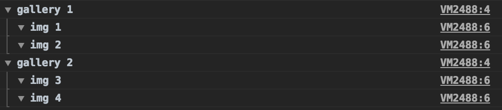

# Про отладку

Конспект [конспекта](https://bespoyasov.ru/blog/debug-it/) книги Пола Батчера [Debug it! Find, Repair, and Prevent Bugs in Your Code](https://www.amazon.com/Debug-Repair-Prevent-Pragmatic-Programmers/dp/193435628X)

## Глава 1. Посреди безумия

Отдебажить — это больше, чем «сделать так, чтобы баг исчез».


 Составляющие эффективного дебагинга:

- понять, почему программа ведёт себя не так, как ожидается;
- исправить ошибку;
- не поломать ничего по дороге;
- не испортить качество кода: читаемость, архитектуру, покрытие тестами и др.;
- принять меры, чтобы подобная проблема не появлялась в будущем.

Не стоит начинать писать заплатку, не разобравшись, что происходит. Это плохо, потому что может поломать то, что работало.

Понять проблему помогают наблюдения. Можно относительно просто провести эксперимент и посмотреть, как работает код.

Дебагинг состоит из 4 этапов:

- _воспроизвести_, найти способ точно и удобно воспроизвести проблему;
- _определить причину_, построить гипотезу проблемы и протестировать её на экспериментах;
- _починить проблему_, не ломая поведение других частей программы;
- _подумать, как предупредить_, что сделать, чтобы не допускать подобных проблем в будущем.

Перед тем, как пробовать воспроизвести проблему, надо определиться, как программа должна работать, и что именно происходит не правильно.

Исправляйть ошибки следует одну за одной, не пытаясь решить несколько проблем за раз. Ошибки могут быть связаны, если чинить всё разом, можно эти связи упустить.

## Глава 2. Воспроизвести

Если проблему нельзя воспроизвести, то её нельзя починить.

Если есть баг‑репорт, повторите шаги оттуда. При этом не забывайте контролировать и сверять

- _версию браузера_,
- _версию ОС_,
- _вводимые данные_ (не забывайте про пограничные значения),
- _версию API_
- _версию вашего приложения_.

Воспроизведение ошибок должно быть не только точным, но и удобным. Поэтому надо убирать лишние шаги, которые не относятся к проблеме. Чем короче путь до проблемы, тем проще её решать.

Есть "плавающие" баги, которые иногда появляются, иногда нет. // TODO

## Глава 3. Определить причину

Когда удалось воспроизвести проблему, нужно заново понять, как именно код работает.

Для этого необходимо строить гипотезы о причинах нежелательного поведения и проводить эксперименты.

Проводить эксперименты лучше в "чистой" ветке, чтобы всегда можно было отследить, что именно вы меняли.

Перед каждым экспериментом лучше понимать, что именно вы пытаетесь проверить, потому что иначе эксперимент бесполезен.

Результат эксперимента может согласовываться с определенной гипотезой (слабое свидетельство в пользу гипотезы), а может опровергать её (сильное свидетельство против гипотезы).

Базовое правило для эксперимента — одно изменение в программе за раз. Множественные изменения могут привести к неправильным выводам.

Не игнорируйте странности. Всё, что вы не понимаете — потенциально баг.

Используйте "бинарный поиск" для определения места, откуда идёт проблема.

Анализируйте, правильную ли часть программы или окружения вы изменяете. Если в результате ничего не меняется, то вы меняете не то, что собирались изменить.

Попробуйте объяснить проблему кому‑то, попробуйте её записать. Отдохните.

## Глава 4. Исправить проблему

Начинайте писать фиксы в чистой ветке.

Перед началом проверьте, что имеющиеся тесты проходят — это нужно для уверенности, что фикс не поломал другую функциональность. Если автотестов нет, то можно их написать или хотя бы представить и зафиксировать план ручного тестирования исправления.

Вам в любом случае нужен тест, который будет падать, демонстрируя проблему, и который будет проходить после исправления, демонстрируя успешность правок.

Исправляйте причину, а не следствия ошибки. Чтобы добраться до причины, надо полностью понять проблему. Если во время объяснения вы произносите нечто вроде «по какой‑то причине» или «не особо ясно, почему здесь так», то до корня проблемы вы ещё не добрались, и фикс не починит её полностью.

Никогда не проводите рефакторинг совместно с фиксом ошибки. Либо вы чините код, либо рефакторите.

## Глава 5. Не допускать такой ошибки в будущем

Примите меры, чтобы подобные ошибки не случались в будущем: проверьте похожие места, напишите тесты.

Проверьте, что решение проблемы соответствует кодстайлу и архитектуре.

## Глава 6. Определяем, что у нас проблемы

В идеальном мире баги проходят через баг-трекер. Это дает более или менее стандартное описание багов, позволяет видеть приоритеты, хранить историю и, возможно, причины, по котороым могли отказаться исправлять тот или иной баг.

## Глава 7. Прагматичная нетерпимость к багам

Баги надо чинить в первую очередь, это уменьшает неопределённость и технический долг. Чем больше багов будет копиться, тем более пофиг на них будет — такого допускать нельзя.

Между «ой да плевать, пусть идёт как идёт» и «в проекте всё будет идеально вылизано» следует выбирать нечто посередине, чуть ближе к правому краю: 


Быстрых фиксов не существует — разбираться в проблеме придётся каждый раз. Чтобы было проще:

- настройте систему версий, сборку проекта, автотесты, CI, CD;
- отделите хороший код: чистый, оттестированный, отдебаженный — от плохого.


## Глава 9. Идеальное окружение для отладки

У вас должны быть автотесты. Критерии хороших тестов:

- Вы должны доверять своим тестам. Если они падают — на то должна быть причина. Если тест иногда падает, иногда нет, доверять ему не будут.
- Тест не должен требовать ручной настройки окружения. Ему оно либо не нужно, либо окружение настраивается автоматически.
- Тест не должен зависеть от других тестов. Он полностью независим оттого, сколько и какие тесты в наборе, а также от хода и результатов выполнения других тестов.
- Тесты должны покрывать как минимум всю важную часть логики и компонентов программы. 


# Про Git

Есть набор процедур, которые исполняет каждый участник команды, чтобы все вместе могли достичь высокой управляемости процесса разработки.

У нас есть "центральный" репозиторий origin. Каждый разработчик забирает и публикует изменения (pull & push) в origin.

Центральный репозиторий содержит две главные ветки, существующие всё время:

- master
- develop

Исходный код в origin/master должен находиться в состоянии production-ready в любой произвольный момент времени.

Ветка origin/develop считается главной для разработки. Хранящийся в ней код в любой момент времени должен содержать самые последние изданные изменения, необходимые для следующего релиза.

Когда исходный код в ветке разработки (develop) достигает стабильного состояния и готов к релизу, все изменения должны быть определённым способом влиты в главную ветку (master) и помечены тегом с номером релиза.

Можно сказать, что вливание в master по определению и есть релиз.

Помимо главных ветвей master и develop существует несколько типов вспомогательных ветвей, которые используются для распараллеливания разработки, для подготовки релизов и для быстрого исправления проблем в производственной версии приложения.

- Ветки функциональностей (Feature branches)
- Ветки релизов (Release branches)
- Ветки исправлений (Hotfix branches)

У каждого типа ветвей есть свой срок жизни, специфическое назначение и строгий набор правил, от каких ветвей они могут порождаться, и в какие должны вливаться.


## Ветки функциональностей (feature branches)


Могут порождаться от: develop
Должны вливаться в: develop
Соглашение о наименовании: всё, за исключением master, develop, release-* или hotfix-*

Живёт так долго, сколько продолжается разработка данной фичи. Когда работа в ветке завершена, вливается обратно в develop (что означает, что функциональность будет добавлена в грядущий релиз) или же удаляется (в случае неудачного эксперимента).

### Вливание в develop

Merge VS Rebase

Выбор зависит от ваших предпочтений относительно того, как должна выглядеть история.

Некоторые предпочитают делать `merge`, причем с флагом `--no-ff`:

`$ git merge --no-ff myfeature`

Флаг --no-ff вынуждает Git всегда создавать новый объект коммита при слиянии, даже если слияние может быть осуществлено алгоритмом fast-forward. Это позволяет не терять информацию о том, что ветка существовала, и группирует вместе все внесённые изменения.

Некоторые предпочитают `merge` с fast-forward.

Некоторые предпочитают делать `rebase`, потому что стремятся к краткой и линейной истории изменений.

### Инструменты для изменения истории:

`Warning: не меняйте те коммиты, которые уже могли забрать себе другие разработчики!` 

Для изменения последнего коммита
```
$ git commit --amend
```

С помощью `rebase` можно взять все коммиты из одной ветки и повторить их на другой.

```
$ git checkout myfeature
$ git rebase develop
```

Можно выполнить интерактивный `rebase`:

```
$ git checkout myfeature
$ git rebase -i develop
```

```
pick a88e4ef Started myfeatrue
pick b52e4ec fix
pick c98e5gb Added random component
pick a11dfef Added something else

# Rebase e223fb9..a88e4ef onto e223fb9 (1 command)
#
# Commands:
# p, pick = use commit
# r, reword = use commit, but edit the commit message
# e, edit = use commit, but stop for amending
# s, squash = use commit, but meld into previous commit
# f, fixup = like "squash", but discard this commit's log message
# x, exec = run command (the rest of the line) using shell
# d, drop = remove commit
#
# These lines can be re-ordered; they are executed from top to bottom.
#
# If you remove a line here THAT COMMIT WILL BE LOST.
#
# However, if you remove everything, the rebase will be aborted.
#
# Note that empty commits are commented out
```

Коммиты выводятся в обратном порядке в отличие от результата команды `git log`:

```
$ git log

pick a11dfef Added something else
pick c98e5gb Added random component
pick b52e4ec fix
pick a88e4ef Started myfeatrue
```

Во время интерактивного `rebase` можно поменять порядок коммитов.

Опции для интерактивного `rebase`:

- `p, pick` = просто оставить коммит "на месте"
- `r, reword` = остаявить коммит и отредактировать его сообщение
- `e, edit` = на этом коммите сценарий прервется, будет возможность отредактировать сообщение, убрать/добавить какие-либо файлы, или даже отменить этот коммит через `git reset HEAD^` и поместить вместо него произвольное количество коммитов
- `s, squash` = объединить коммит с предыдущим; сообщения объединяются, их можно отредактировать
- `f, fixup` = объединить коммит с предыдущим; отбросить текущее сообщение
- `x, exec` = запустить какую-либо команду после этого шага в сценарии; например, можно прогонять тесты
- `d, drop` = удалить коммит


`Общая рекомендация` по ведению истории изменений: следует коммитить каждое логическое изменение, причем одно за раз. Перед публикацией изменений стоит воспользоваться `rebase`, чтобы "почистить" коммиты вроде 'test' и 'fix'. Объединять все коммиты в рамках разработанной фичи в один, пожалуй, все же не стоит, потому что это может затрудить отладку в будущем.

 `Чаще отдавайте свои изменения на ревью.`


## Ветки релизов (release branches)

Могут порождаться от: develop
Должны вливаться в: develop и master
Соглашение о наименовании: release-*

Используются для подготовки к выпуску новых версий. В них можно добавлять минорные исправления, а также подготавливать метаданные для очередного релиза (номер версии, дата сборки и т.д.).

Новую ветку релиза надо порождать в тот момент, когда ветка develop полностью или почти полностью готова, т.е. по крайней мере, вся необходимая функциональность, предназначенная к этому релизу, уже влита в develop.

Очередной релиз получает свой номер версии только в тот момент, когда для него создаётся новая ветка, но ни в коем случае не раньше. Вплоть до этого момента develop содержит изменения для «нового релиза», но пока ветка релиза не отделилась, точно неизвестно, будет ли этот релиз иметь версию 0.3, или 1.0, или какую-то другую. Решение принимается при создании новой ветки релиза и зависит от [принятых на проекте правил нумерации версий](https://semver.org/).

Новая ветка релиза может существовать некоторое время, до тех пор, пока новый релиз окончательно не будет готов к выпуску. В течение этого времени к этой ветке (а не к develop) могут быть добавлены исправления найденных багов. Но добавление крупных новых изменений в эту ветку строго запрещено. Они всегда должны вливаться в develop и ждать следующего большого релиза.

В итоге ветку релиза надо влить в master. Если в ветке релиза были сделаны какие-то исправления багов, то их необходимо влить и в develop.

## Ветви исправлений (hotfix branches)

Могут порождаться от: master
Должны вливаться в: develop и master
Соглашение о наименовании: hotfix-*

Похожи на ветви релизов, так как они тоже используются для подготовки новых выпусков, разве что незапланированных. Смысл существования  hotfix ветки состоит в том, что работа команды над develop может спокойно продолжаться, в то время как кто-то один готовит быстрое исправление продакшн версии.

Когда баг исправлен, изменения надо влить обратно в master, а также в develop, чтобы гарантировать, что это исправление окажется и в следующем релизе.

Если в данный момент существует ветка релиза, то ветка исправления должна вливаться в неё, а не в develop. В этом случае исправления войдут в develop вместе со всей ветвью релиза, когда та будет закрыта.

Для автоматизации описанных процедур создан [gitflow](https://github.com/nvie/gitflow).

# Про отладку и Git

## TODO как искать всякое в гите https://medium.com/@tygertec/how-to-find-stuff-in-git-35d4cb8c1845

Используйте `аннотации` `git blame` для того, чтобы узнать, кто, когда и зачем поменял внес непонятное изменение.

Можно использовать в консоли или в интерфейсе  bitbucket/gitlab/github.


А лучше установить плагин для своего редактора ([GitLens](https://gitlens.amod.io/), [GitHistory](https://marketplace.visualstudio.com/items?itemName=donjayamanne.githistory), etc).

Используйте `бинарный поиск`, если не знаете, что сломалось и с чего начать. 

Команда `bisect` выполняет бинарный поиск по истории коммитов, и призвана помочь как можно быстрее определить, в каком коммите была внесена ошибка.

Сначала выполните `git bisect start`, чтобы запустить процесс, а затем `git bisect bad`, чтобы сказать системе, что текущий коммит, на котором вы сейчас находитесь, сломан. Затем, необходимо сказать `bisect`, когда было последнее известное хорошее состояние с помощью `git bisect good [хороший_коммит]`.

После этого Git выгрузит версию из середины между этими двумя коммитами, можно будет провести свои тесты и пометить этот серединный коммит, как хороший или плохой. Процесс продолжается, пока вы не доберетесь до конкретного коммита, в котором появилась ошибка.

Чтобы вернуться в исходное состояние используйте `git bisect reset`.

Бинарный поиск по истории будет тем эффективнее, чем точнее и самодостаточнее организованы ваши коммиты.

# Про отладку фронтенда


## console.log()

## console.assert(выражение, сообщение)
Console.assert выдает ошибку, если вычисленное выражение false. 

## console.count(ярлык)
Это console.log, который подсчитывает, сколько раз он был вызван с тем же самым выражением.

## console.table()
```js
const fruits = [
  { name: 'apple', like: true },
  { fff: 'pear', like: true },
  { name: 'plum', like: false },
];
console.table(fruits);
```


Вторым аргументом можно указать только требуемые ключи. 

```js
console.table(fruits), ['name'];
```
Бонус: таблица сортируемая.

## console.group()

```js
const galleries = [{id: 1, value: [{src: '1'},{src: '2'}]},{id: 2, value: [{src: '3'},{src: '4'}]}];

galleries.forEach(gallery => {
  console.group(`gallery ${gallery.id}`);
  gallery.value.forEach(img => {
    console.group(`img ${img.src}`);
    console.groupEnd();
  });
  console.groupEnd();
});
```



git: bisect, rebase, squash, git flow, линтеры, ide, техники дебага


Гораздо больше про отладку фронтенда [тут](https://medium.com/@stylesam/api-%D0%BA%D0%BE%D0%BC%D0%B0%D0%BD%D0%B4%D0%BD%D0%BE%D0%B9-%D1%81%D1%82%D1%80%D0%BE%D0%BA%D0%B8-%D0%BA%D0%BE%D0%BD%D1%81%D0%BE%D0%BB%D0%B8-%D1%81%D0%BF%D1%80%D0%B0%D0%B2%D0%BA%D0%B0-%D0%BA%D0%BE%D0%BC%D0%BC%D0%B0%D0%BD%D0%B4-d5b87608cbf1)


Ссылки:

1. [Отдебажь это! Часть 1](https://bespoyasov.ru/blog/debug-it/)
1. [Отдебажь это! Часть 2](https://bespoyasov.ru/blog/debug-it-part2/)
1. [Удачная модель ветвления в Git](https://habr.com/post/106912/)
1. [Инструменты Git - Перезапись истории](https://git-scm.com/book/ru/v1/%D0%98%D0%BD%D1%81%D1%82%D1%80%D1%83%D0%BC%D0%B5%D0%BD%D1%82%D1%8B-Git-%D0%9F%D0%B5%D1%80%D0%B5%D0%B7%D0%B0%D0%BF%D0%B8%D1%81%D1%8C-%D0%B8%D1%81%D1%82%D0%BE%D1%80%D0%B8%D0%B8)
1. [Инструменты Git - Отладка с помощью Git](https://git-scm.com/book/ru/v1/%D0%98%D0%BD%D1%81%D1%82%D1%80%D1%83%D0%BC%D0%B5%D0%BD%D1%82%D1%8B-Git-%D0%9E%D1%82%D0%BB%D0%B0%D0%B4%D0%BA%D0%B0-%D1%81-%D0%BF%D0%BE%D0%BC%D0%BE%D1%89%D1%8C%D1%8E-Git)

