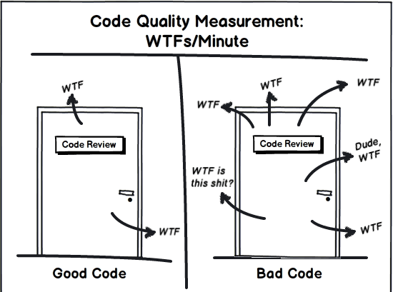

# Практики хорошего кода

## О чем это

Термины «хороший» и «плохой» код нечеткие.

Чтобы научиться различать хороший и плохой код надо потратить время.

Чтобы научиться писать хороший код надо потратить время.

Изначально у нас есть набор базовых знаний, в который не входит умение писать красивый профессиональный код.

Обычно это умение приходит вместе с практическим опытом, чаще всего в той или иной степени негативным.

Но путь к хорошему коду можно срезать, если учитывать опыт других людей и практиковаться!

## Вы должны писать хороший код

Код гораздо чаще читают, нежели пишут.

Следовательно код должен быть приспособлен к тому, чтобы его понимали люди, а не только машины.

Понятность кода обеспечивается хорошей, наглядной, ясной, недвусмысленной (и т.д.) организацией.

Такая организация невозможна без проектирования.

Перед написанием код необходимо спроектировать.

Проектирование дает:

- ### Простоту и понятность

  Чтобы _в будщем_ разработчик смог быстро разобраться и доработать компонент под изменившиеся требования.

- ### Корректность

  Чтобы _в будщем_ инженер своими правками случайно не сломал работоспособность системы.

- ### Расширяемость

  Чтобы _в будщем_ инженеру проще было вносить доработки под новые требования.

- ### Универсальность

  Чтобы _в будщем_ инженеру было проще использовать этот код в контексте другой задачи или проекта.

Код нельзя рассматривать, как свершившийся факт, необходимо учитвывать, что он будет меняться.
Любые признаки хорошего и плохого кода важны только в контексте изменения. Важно то, как они будут помогать или мешать вносить изменения.

## Что такое плохой код

### Код плох, если

когда приходит новая задача...

- ...надо много переделывать (жесткость)

  переделывая код, можно внести нежелательные правки и дефекты

- ...трогать код опасно (хрупкость)

  при внесении правок есть страх, что сломается что-то другое

- ...проще сделать «в обход» (вязкость)

  возможно, уже есть какой-то инструмент для решения, но вместо этого все делается с нуля

- ...не получается использовать готовое решение в новом контексте (неподвижность)

## «Низкоуровневые» принципы хорошего кода

- простота

- максимальная линейность

- краткость

- самодокументируемость

## KISS (Keep It Simple Stupid)

Все должно быть изложено так просто, как только возможно (но не проще).

Простой код лучше сложного по всем параметрам — проще для понимания, легче поддается изменениям и тестированию, требует меньше комментариев и документации, содержит меньше ошибок.

Идеальный код — тот, которого нет, причем задача, которую он должен решать — успешно решается.

## DRY (Don't repeat yourself)

## Правила хорошего кода

важность линтеров, почему явное лучше не явного, что такое KISS и SOLID, DRY, SRP, про декомпозицию и организацию, что нужно делать комментарии, про зло дублирования, про зло ветвления, про преимущества декларативной логики перед императивной, зачем писать тесты

Хорошие комментарии должны описывать не действия кода, а причину этих действий. Сюда относятся смысловые описания фич, отсылки на документацию о странных, неочевидных или малоизвестных особенностях, отсылки к багрепортам в сторонних проектах при написании заплаток и костылей по независящим от Вас причинам, и т.д. Также очень удобно пользоваться комментариями для описания действия блока кода, ибо создание функций и процедур только для самодокументируемости приведет к огромному количеству этих самых функций и процедур, в которых потом черт ногу сломит.
